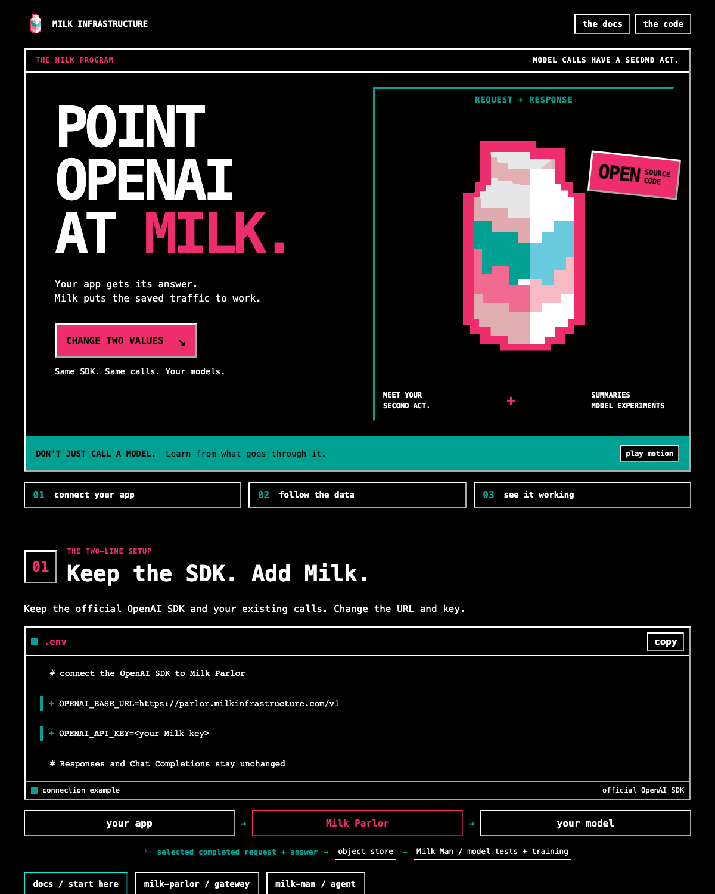
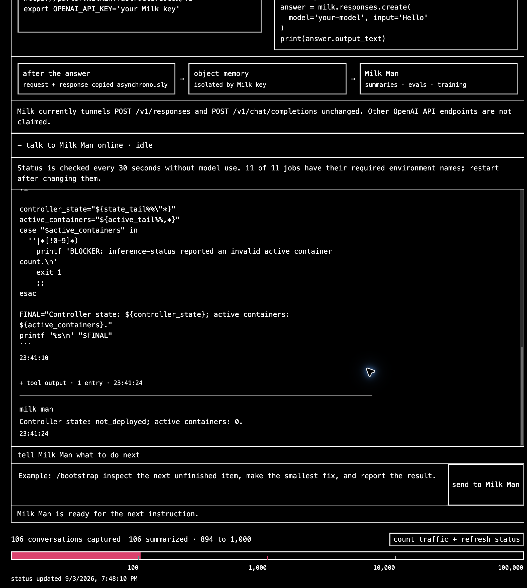
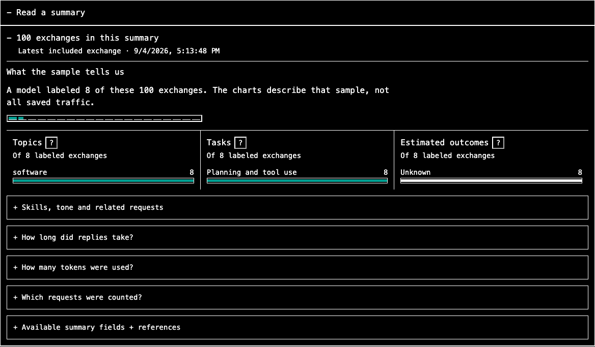

# Milk Infrastructure

The dependency-free static landing page for
[milkinfrastructure.com](https://milkinfrastructure.com). It explains how the
official OpenAI SDK connects to the Milk Parlor gateway and how Milk Man uses
the completed traffic saved behind it. The public developer guide lives at
[`/docs/`](https://milkinfrastructure.com/docs/).

Keep the official OpenAI SDK. Change its base URL and key. Milk Parlor forwards
the request; Milk Man uses the saved request and response for summaries and
model experiments. The heartbeat counts exchanges without a model call;
configured milestones start summary jobs.



The landing page uses the original pixel carton, pink and teal, and hard-edged
TV title cards. The setup, data loop and recorded dashboard screens stay in
separate sections. Motion can be paused and follows the device's reduced-motion
setting.





These are actual development screens captured September 4, 2026. They show a
completed small training run and a summary of 100 exchanges, not a claim that
the trained model performs better on real tasks.

## Local preview

```bash
python3 -m http.server 8000
```

Open <http://127.0.0.1:8000>.

The site is plain HTML, CSS and two small buttons: copy and pause motion. No build or dependency install
is needed. `index.html` is the landing page; `docs/index.html` is the guide.
Screenshots live in `screens/`. Publish only these public files and `_headers`;
never upload local credentials or the `.wrangler` cache.

The Berkeley Mono font is separately licensed; the repository's MIT license
does not apply to the font file.

When replacing a screenshot or stylesheet, update its URL version in the HTML
so returning visitors get the matching file. Keep screenshots uncropped.
